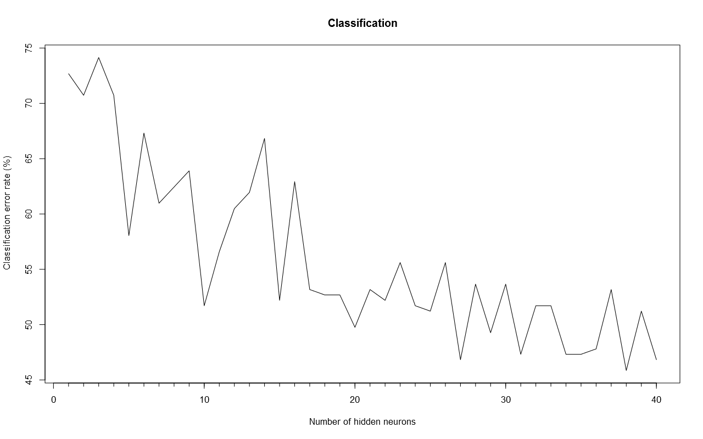

```{r setup, include=FALSE}
rm(list=ls())
library(knitr)
library(cvTools)
opts_chunk$set(echo = FALSE)
opts_knit$set(root.dir = '../02450Toolbox_R')
source("../Project/load-data.R")

featuresmpg <- c('normalized-losses', 'fuel-type', 'aspiration', 'drive-wheels', 'wheel-base', 'curb-weight', 'num-of-cylinders', 'engine-size', 'compression-ratio', 'horsepower', 'peak-rpm', 'city-mpg', 'price')

features_hp <- c('normalized-losses', 'wheel-base', 'length', 'width', 'bore', 'price', 'make.jaguar', 'make.mercedes-benz', 'make.porsche', 'aspiration.turbo', 'wheel-base', 'curb-weight', 'num-of-cylinders', 'engine-size',  'engine.type.dohc', 'engine.type.ohcy', 'horsepower', 'engine.location.rear','drive.wheels.rwd', 'fuel.system.mpfi')

c(dat, names, NAs) := loaddata(normalise = FALSE, removeNAs = FALSE, oneofKenc = FALSE)

```


# Regression

The regression part of this report will focus on predicting how much horsepower a car has based on the other features in the data set. Various kinds of machine learning methods are available to perform regression, but the most simple is linear regression.

As a starting point, linear regression is performed on all the features to include as much data as possible. In order to avoid over-fitting it can be beneficial to apply sequential feature selection and thus improve the model performance.

The performance of the two models are tested through 4-fold cross-validation, and it turns out that the test classification error is nearly the same with and without forward selection. The results can be seen in Table \ref{tab:linerr}. You might see this as the forward selection is a waste of time and resources, but you can also see this as you have identified attributes carrying the most information and reducing the data set. It is worth noting from the table that there without feature selection is some difference between the training and the test error, whereas the two move closer together when applying forward selection.


```{r Regression Error rates}
regresults <- data.frame(Without.feature.selection = c(0.0177, 0.1175), With.feature.selection = c(0.0632,0.1077))
names(regresults) <- gsub('.', ' ', names(regresults), fixed = TRUE)
rownames(regresults) <- c("Training error", "Test error")

kable(regresults, caption = "\\label{tab:linerr}The error rates when using linear regression to predict the horsepower of cars.")
```


The horsepower of a new data point is predicted by multiplying each of the input attributes with the corresponding weight and a single output value is achieved, which is the predicted horsepower.


## Applying an artificial neural network

Artificial neural networks are able to learn very complex connections and patterns in data. There is a risk that they may over-fit the data, and it is thus important to check if there is a large difference between the training error and the test error.

A neural network with 8 hidden neurons is fitted to the data, and its performance is evaluated using 4-fold cross-validation and 20-fold cross-validation, respectively. The results can be seen in Table \ref{tab:ANNerr}. 

```{r ANN Error rates}
regresults <- data.frame(Four.fold = c(0.00018, 5.74204), Twenty.fold = c(0.00428, 35.39973))
names(regresults) <- c("4-fold cross-validation", "20-fold cross-validation")
rownames(regresults) <- c("Training error", "Test error")

kable(regresults, caption = "\\label{tab:ANNerr}The error rates when using artificial neural networks to predict the horsepower of cars.")
```


```{r Error comparison, include=FALSE, cache=TRUE}
# exercise 6.3.1
rm(list=ls())
library(cvTools)
library(neuralnet)
source("setup.R")

# Load data
source("../Project/load-data.R")
c(dat, names, NAs) := loaddata(normalise = FALSE, removeNAs = TRUE, oneofKenc = TRUE)

# Define features
y <- dat[["horsepower"]]
dat <- dat[-which(names(dat) %in% c("horsepower"))]

#### Format Data ####
# Data matrix
X <- dat
# Number of observations
N <- nrow(dat)
# Attribute (Feature) Names
attributeNames <- attributeNames <- gsub('-', '.', names(dat))
colnames(X) <- attributeNames
# Number of features
M <- ncol(dat)


hpLinreg <- function(X_train, y_train, X_test, y_test){
  X_traindf <- data.frame(X_train)
  X_testdf <- data.frame(X_test)
  if(dim(as.matrix(X_train))[2]!=0){
    xnam <- paste("X", 1:dim(as.matrix(X_train))[2], sep="")
    colnames(X_traindf) <- xnam
    colnames(X_testdf) <- xnam
    (fmla <- as.formula(paste("y_train ~ ", paste(xnam, collapse= "+"))))
  }else{
    xnam <- 1
    (fmla <- as.formula(paste("y_train ~ ", paste(xnam, collapse= "+"))))
  }
  mod = lm(fmla, data=X_traindf)
  preds <- predict(mod, newdata = X_testdf)
  sum((y_test-preds)^2)  
}

hpANN <- function(X_train, y_train, X_test, y_test){
  X_traindf <- data.frame(X_train)
  X_testdf <- data.frame(X_test)

  attributes <- colnames(X_traindf)
  
  xnam <- paste0("X", 1:dim(as.matrix(X_train))[2])
  colnames(X_traindf) <- xnam
  colnames(X_testdf) <- xnam
  
  ## Fit multiclass neural network to training set
  (fmla <- as.formula(paste("y_train ~ ", paste(xnam, collapse= "+"))))

  netwrk = neuralnet(fmla, X_traindf, hidden=NHiddenUnits, act.fct='tanh', linear.output=TRUE, err.fct='sse');

  computeres <- compute(netwrk, X_testdf)
  y_test_est = unlist(computeres$net.result)

  sum((y_test-y_test_est)^2)
}


## Crossvalidation

# Create 10-fold crossvalidation partition for evaluation
K = 10;
set.seed(1234) # for reproducibility
CV <- cvFolds(N, K=K)
# set up vectors that will store sizes of training and test sizes
CV$TrainSize <- c()
CV$TestSize <- c()

# Initialize variables
Error_reg = rep(NA, times=K)
Error_ANN = rep(NA, times=K)
Error_avg = rep(NA, times=K)

# For each crossvalidation fold
for(k in 1:K){
    print(paste('Crossvalidation fold ', k, '/', K, sep=''));
    
    # Extract the training and test set
    X_train <- X[CV$which!=k, ];
    y_train <- y[CV$which!=k];
    X_test <- X[CV$which==k, ];
    y_test <- y[CV$which==k];
    CV$TrainSize[k] <- length(y_train)
    CV$TestSize[k] <- length(y_test)
    X_traindf <- data.frame(X_train)
colnames(X_traindf) <- attributeNames
    X_testdf <- data.frame(X_test)
colnames(X_testdf) <- attributeNames
    

# construct formula to fit automatically to avoid typing in each variable name
fmla <- as.formula(paste("y_train ~ ", paste(attributeNames, collapse= "+")))

	# LinReg
	Error_reg[k] = hpLinreg(X_train, y_train, X_test, y_test);

	# ANN
	NHiddenUnits = 8	# Number of hidden neurons
	Error_ANN[k] = hpANN(X_train, y_train, X_test, y_test);

  # Mean
  meanHp <- mean(y_train)
  Error_avg[k] = sum((y_test-meanHp)^2)
}

Error_reg <- Error_reg/CV$TestSize
Error_ANN <- Error_ANN/CV$TestSize
Error_avg <- Error_avg/CV$TestSize


```


## Performance comparison

It is relevant to test if one of the fitted models perform significantly better than the other, and importantly, if they perform significantly better than just predicting the average value each time. A paired t-test is used to test this. In Table \ref{tab:ttests} it is seen that all the models perform significantly different, which means that linear regression performs significantly better than artificial neural networks that performs significantly better than just predicting the average of the training data set.


```{r, fig.cap='\\label{fig:regboxplot}A box plot of the distribution of mean square errors in the 10-fold cross-validation.', fig.height=3}
errorplot <- data.frame(cbind(Error_reg, Error_ANN, Error_avg))
colnames(errorplot) <- c('Linear regression', 'Neural Network', 'Average value')
par(mar=c(3.1,4.1,1.1,2.1))
boxplot(errorplot, ylab="Mean square error", col = 2:4)
```


```{r Pairwise paired t-tests, cache=TRUE}

errors <- data.frame(data=c(Error_reg, Error_ANN, Error_avg),
                key=c(
                  rep("reg", length(Error_reg)),
                  rep("ANN", length(Error_ANN)),
                  rep("avg", length(Error_avg)))
)

l <- pairwise.t.test(errors$data, errors$key, pool.sd = FALSE, paired = TRUE, p.adjust.method = "none")

kable(format(signif(l$p.value, 3), scientific = TRUE), caption = "\\label{tab:ttests}Paired t-tests results in the P-values in this table. They all test if the difference in average error is 0 or not.", format = 'latex')

```


# Classification

This part of the report will be about classifying the cars into discrete groups. Specifically, it will focus on classifying the cars into four categories of the average gas consumption per mile driven, which is a new feature based on the 'city-mpg' feature. The feature is generated based on the following rules:

- Very low = city-mpg <= Q1
- Low = Q1 < city-mpg <= median
- High = median < city-mpg <= Q3
- Very high = Q3 < city-mpg

Where Q1 means the lower quartile and Q3 means the upper quartile. The number of observations in each category is shown in Table \ref{tab:freq}.

```{r Feature definition}
y <- dat[["city-mpg"]]
dat <- dat[-which(names(dat) %in% c("city-mpg","highway-mpg"))]
class_names <- c("Very low", "Low", "High", "Very high")

yclass = factor(length(y), levels = 1:4, labels = class_names, ordered = FALSE)
yclass[y <= quantile(y,0.25)] <- class_names[1]
yclass[quantile(y,0.25) < y & y <= median(y)] <- class_names[2]
yclass[median(y) < y & y <= quantile(y,0.75)] <- class_names[3]
yclass[quantile(y,0.75) < y] <- class_names[4]

kable(t(as.matrix(table(yclass))), caption = "\\label{tab:freq}The number of observations in each of the categories of the discrete city-mpg feature.")
```

When applying the machine learning methods, neither the discrete nor the continuous version of the 'city-mpg' feature will be in the data set, just as the feature 'highway-mgp' is excluded as well. In the hope of improving the performance of the machine learning methods, a subset of features, which are intuitively believed to influence the fuel economy, was selected by hand. This subset of the data set is in the following sections compared to the full data set.


## Decision trees

Decision trees are an easily interpretable way of classifying data into an arbitrary number of categories. This makes them well-suited as a starting point for classifying this data set.

First, a standard decision tree model is fitted to the data. The model can be seen in Figure \ref{fig:tree}. This is a rather large tree, which is a cause of a lot of splits that may result in over-fitting. Pruning can be applied to avoid over-fitting. However, how much pruning is necessary to obtain the optimal model varies a lot from case to case. Thus, cross-validation is used to select the optimal pruning level for this case.

It is seen in Figure \ref{fig:tree-pruning} that there is a local classification error minimum for a pruning level of around 0.1. However, the global minimum for the test classification error is for pruning levels above 0.35, where it stabilises below 75 %. It seems that the model fails to properly classify new data points, and the lowest classification error is thus achieved by always predicting 'High'.

When a decision tree is to predict the class of a new data point, it starts at the top of the tree and at each split it checks if the answer to the question is true or false. When true, it goes left, and when false, it goes right, until the bottom of the tree is reached and the point is successfully classified.

```{r Decision trees crossvalidation, cache=TRUE}

# exercise 6.1.2
#rm(list=ls())
#library(rpart)
#source("setup.R")

#### Format Data ####
# Data matrix
X <- dat
# Number of observations
N <- nrow(dat)
# Attribute (Feature) Names
attributeNames <- attributeNames <- gsub('-', '.', names(dat))
colnames(X) <- attributeNames
# Number of features
M <- ncol(dat)
# Vector y
y <- as.integer(yclass)
# No. of categories in vector y
C <- length(unique(yclass))
# Class names of vector y
classNames <- class_names

# substitute spaces with dots to make handling of columns in data matrix easier
attributeNames <- gsub(' ', '.', attributeNames)

# Number of folds for crossvalidation
K = 10;

# Create k-fold crossvalidation partition
set.seed(1234) # for reproducibility
CV <- cvFolds(length(y), K=K)
# set up vectors that will store sizes of training and test sizes
CV$TrainSize <- c()
CV$TestSize <- c()

# Pruning levels
prune <- seq(from=0, to=0.50, length.out=20)

# Variable for classification error
Error_train = matrix(rep(NA, times=K*length(prune)), nrow=K)
Error_test = matrix(rep(NA, times=K*length(prune)), nrow=K)

for(k in 1:K){
    #print(paste('Crossvalidation fold ', k, '/', K, sep=''))

    # Extract training and test set
    X_train <- X[CV$which!=k, ];
    y_train <- y[CV$which!=k];
    X_test <- X[CV$which==k, ];
    y_test <- y[CV$which==k];
    CV$TrainSize[k] <- length(y_train)
    CV$TestSize[k] <- length(y_test)

    Xdatframe_train <- data.frame(X_train)
    colnames(Xdatframe_train) <- attributeNames
    classassignments <- classNames[y_train]

    # construct formula to fit automatically to avoid typing in each variable name
    (fmla <- as.formula(paste("classassignments ~ ", paste(attributeNames, collapse= "+"))))

    # fit classification tree
    mytree <- rpart(fmla, data=Xdatframe_train,control=rpart.control(minsplit=2, minbucket=1, cp=0.01), parms=list(split='deviance'), method="class")

    Xdatframe_test <- data.frame(X_test)
    colnames(Xdatframe_test) <- attributeNames

    # Compute classification error
    for(n in 1:length(prune)){ # For each pruning level
        mytree_pruned <- prune(mytree,prune[n])
        predicted_classes_train<- classNames[predict(mytree_pruned, newdat=Xdatframe_train, type="vector")]
        predicted_classes_test<- classNames[predict(mytree_pruned, newdat=Xdatframe_test, type="vector")]
        Error_train[k,n] = sum(classNames[y_train]!= predicted_classes_train)
        Error_test[k,n] = sum(classNames[y_test]!= predicted_classes_test)
    }
}
```


```{r Decision trees plot, fig.cap='\\label{fig:tree}A non-pruned decision tree. Note that there are a lot of splits', cache=TRUE, fig.height=3}
rpart.plot(mytree)
```


```{r Decision trees classification error, fig.cap='\\label{fig:tree-pruning}How pruning effects the classification error. Note that for high values of pruning, the training classification error stabilises around 75 %.', fig.height=4, cache=TRUE}

# Plot classification error
plot(c(min(prune), max(prune)), c(min(colSums(Error_train)/sum(CV$TrainSize), colSums(Error_test)/sum(CV$TestSize)), max(colSums(Error_train)/sum(CV$TrainSize), colSums(Error_test)/sum(CV$TestSize))), xlab = 'Pruning level', ylab='Classification error', type="n")
points(prune, colSums(Error_train)/sum(CV$TrainSize), col="blue")
points(prune, colSums(Error_test)/sum(CV$TestSize), col="red");
legend('topleft', legend=c('Training error', 'Test error'), fill=c("blue", "red"));

```


## Multinomial Regression

Multinomial regression is an expansion of logistic regression, which works with multiple categories. Since the data set in this report has been thresholded into four categories, this is the way to go.

In this report, instead of selecting parameters for the multinomial regression, parameters for the data are selected through cross-validation. This means that both normalised data and raw data are used in the model and that only some hand-chosen features are used versus all features. This makes K = 4 inner cross-validation loops.

As it is seen in Table \ref{tab:multierr}, the multinomial regression cannot properly classify the cars. It actually performs worse than the pruned decision tree that just predicts the same class for each new observation.

Since multinomial regression is the same as an artificial neural network with no hidden neurons and thus no hidden layer, a new data point is classified by taken the input values and multiplying them with the weight matrix $W$ to an output value for each class and the class with the highest output value is the predicted class for the new observation.


```{r Multinomial Error rates}
mrresults <- data.frame(All.features = "84.62 %", All.features.normalised = "86.54 %", Selected.features = "92.31 %", Selected.features.normalised = "92.31 %")
names(mrresults) <- gsub('.', ' ', names(mrresults), fixed = TRUE)

kable(mrresults, caption = "\\label{tab:multierr}The error rates when using multinomial regression to classify the cars into four classes.")
```


```{r K-Nearest Neighbors, include=FALSE, cache=TRUE}

# exercise 7.1.2
rm(list=ls())
source('setup.R')
library(FNN)
library(cvTools)

# Load data
source("../Project/load-data.R")
c(dat, names, NAs) := loaddata(normalise = FALSE, removeNAs = TRUE, oneofKenc = TRUE)

# Define features
y <- dat[["city-mpg"]]
dat <- dat[-which(names(dat) %in% c("city-mpg","highway-mpg"))]
class_names <- c("Very low", "Low", "High", "Very high")

yclass = factor(length(y), levels = 1:4, labels = class_names, ordered = FALSE)
yclass[y <= quantile(y,0.25)] <- class_names[1]
yclass[quantile(y,0.25) < y & y <= median(y)] <- class_names[2]
yclass[median(y) < y & y <= quantile(y,0.75)] <- class_names[3]
yclass[quantile(y,0.75) < y] <- class_names[4]

#### Format Data ####
# Data matrix
X <- dat
# Number of observations
N <- nrow(dat)
# Attribute (Feature) Names
attributeNames <- attributeNames <- gsub('-', '.', names(dat))
colnames(X) <- attributeNames
# Number of features
M <- ncol(dat)
# Vector y
y <- as.integer(yclass)
# No. of categories in vector y
C <- length(unique(yclass))
# Class names of vector y
classNames <- class_names

# Leave-one-out crossvalidation
CV <- cvFolds(N, K=N);
K = N

# K-nearest neighbors parameters
L = 40; # Maximum number of neighbors

# Variable for classification error
Error = array(rep(NA, times=K*L), dim=c(K,L))

for(k in 1:K){ # For each crossvalidation fold
    #print(paste('Crossvalidation fold ', k, '/', CV$K, sep=''))

    # Extract training and test set
    X_train <- X[CV$which!=k, ];
    y_train <- y[CV$which!=k];
    X_test <- X[CV$which==k, ];
    y_test <- y[CV$which==k];
    CV$TrainSize[k] <- length(y_train)
    CV$TestSize[k] <- length(y_test)

	X_testdf <- data.frame(X_test)
	colnames(X_testdf) <- attributeNames
	X_traindf <- data.frame(X_train)
	colnames(X_traindf) <- attributeNames
        
    for(l in 1:L){ # For each number of neighbors
        
        # Use knnclassify to find the l nearest neighbors
        y_test_est <- knn(X_traindf, X_testdf, cl=y_train, k = l, prob = FALSE, algorithm="kd_tree")
        
        # Compute number of classification errors
        Error[k,l] = sum(y_test!=y_test_est); # Count the number of errors
    }
}

```


## K-Nearest Neighbors (KNN)

The K-Nearest Neighbors algorithm works by simple classifying a new data point as the majority of the K nearest data points. This simple method proves to be sometimes be quite powerful.

It is very easy to visualise how this works in two dimensions, but it works in N-dimensions. This is why, it can easily be applied to this classification problem in this report, though it is multi-dimensional.

Cross-validation is used to find the best value of neighbors for this classification problem. In Figure \ref{fig:neighbors} the classification error is seen as a function of the number of neighbors used for classifying new data points.


```{r KNN plot, fig.cap='The classification error as a function of the number of hidden neurons. \\label{fig:neighbors}', cache=TRUE, fig.height=4}

## Plot the classification error rate
plot(colSums(Error)/sum(CV$TestSize)*100, xlab='Number of neighbors', ylab='Classification error rate (%)', pch=20, type='l');
axis(1, at=1:40, tck=-0.015, labels=FALSE, lwd=0, lwd.ticks=1)

```


<!--  -->


The lowest achieved classification error is 36.10 %. The number of neighbors used to achieve this is K = 4. When using too few neighbors, the classification is prone to being too effected by noise and outliers in the data set, but when using too many neighbors, it is prone to being too conservative and predicting the class with the most observations.

When a new data point is to be classified, the K nearest neighbors are identified and their class is checked. The most frequent class of these points is the class that the new data point is given. If there is a tie, i.e. K is 4 and 2 points are class 1 and class 2, respectively, the class of the neighbor nearest to the new data point is used to break the tie.


```{r Artificial Neural Networks, eval=FALSE, include=FALSE, cache=TRUE}

# exercise 8.3.1
rm(list=ls())
source("setup.R")
library(nnet) # install.packages('nnet')

# Load data
source("../Project/load-data.R")
c(dat, names, NAs) := loaddata(normalise = FALSE, removeNAs = TRUE, oneofKenc = TRUE)

y <- dat[["city-mpg"]]
#dat <- dat[-which(names(dat) %in% c("city-mpg","highway-mpg"))]
dat <- dat[-which(names(dat) %in% c("city-mpg"))]
class_names <- c("Very low", "Low", "High", "Very high")

yclass = factor(length(y), levels = 1:4, labels = class_names, ordered = FALSE)
yclass[y <= quantile(y,0.25)] <- class_names[1]
yclass[quantile(y,0.25) < y & y <= median(y)] <- class_names[2]
yclass[median(y) < y & y <= quantile(y,0.75)] <- class_names[3]
yclass[quantile(y,0.75) < y] <- class_names[4]

#### Format Data ####
# Data matrix
X <- dat
# Number of observations
N <- nrow(dat)
# Attribute (Feature) Names
attributeNames <- attributeNames <- gsub('-', '.', names(dat))
colnames(X) <- attributeNames
# Number of features
M <- ncol(dat)
# Vector y
y <- as.integer(yclass)
# No. of categories in vector y
C <- length(unique(yclass))
# Class names of vector y
classNames <- class_names

# Extract training and test set
K = 10
CV <- cvFolds(N, K=K);

# Artificial Neural Network parameters
L = 40; # Maximum number of hidden neurons

# Variable for classification error
Error = array(rep(NA, times=K*L), dim=c(K,L))

for(k in 1:K){ # For each crossvalidation fold
    print(paste0('Crossvalidation fold ', k, '/', K))

    # Extract training and test set
	X_train <- X[CV$which!=k, ];
	y_train <- y[CV$which!=k];
	CV$TrainSize[k] <- length(y_train)

	X_test  <- X[CV$which==k, ];
	y_test  <- y[CV$which==k];
	CV$TestSize[k] <- length(y_test)

	# substitute spaces with dots to make handling of columns in data matrix easier
	attributeNames <- gsub(' ', '.', attributeNames)
	X_traindf <- data.frame(X_train)
	colnames(X_traindf) <- attributeNames
	X_testdf <- data.frame(X_test)
	colnames(X_testdf) <- attributeNames

	for(l in 1:L){ # For each number of neighbors
        print(paste0('Number of hidden neurons ', l, '/', L))
        # Parameters for neural network classifier
		NHiddenUnits = l;  # Number of hidden units
		## Fit multiclass neural network to training set
		y_trainfact <- factor(y_train)
		fmla <- as.formula(paste("y_trainfact ~ ", paste(attributeNames, collapse= "+")))
		model <- nnet(formula=fmla, data=X_traindf, size=NHiddenUnits, MaxNWts = l*72*1.15, trace=FALSE)
		    
		## Compute results on test data
		# Get the predicted output for the test data
		Y_test_est <- predict(object=model, newdata=X_testdf, type='raw')

		# Compute the class index by finding the class with highest probability from the neural
		# network
		y_test_est = max_idx(Y_test_est);

		# Compute number of classification errors
        Error[k,l] = sum(y_test!=y_test_est); # Count the number of errors
	}
}
```


## Artificial Neural Networks (ANN)

Artificial neural networks are extremely flexible for modeling a wide variety of problems. This is among other things because they have the ability to learn which features in the given data set that are important and weight them accordingly.

Their flexibility, however, also makes them prone to over-fitting, and when training them there is a risk they get stuck in a local minimum instead of correctly landing in the global minimum.

One-out-of-K encoding has been applied to the data set in this report, and thus 68 features are given as input for the network. Furthermore, there are four groups that a data point can be classified into. This structure defines that the network model has 68 input neurons and 4 output neurons. There is one hidden layer and the optimal number of hidden neurons is chosen through cross-validation as a value between 1 and 40.

There is a chance that the network gets stuck in a local minimum, and to reduce the random error introduced by this, the outer cross-validation loop has 10 iterations. The classification error rate as a function of the number of hidden neurons is shown in Figure \ref{fig:neurons}. It is seen that the classification error steadily decreases as the number of hidden neurons increase.


```{r Neural network errorplot, fig.cap='The classification error as a function of the number of hidden neurons. \\label{fig:neurons}', fig.height=3, cache=TRUE, eval=FALSE}

## Plot the classification error rate
plot(colSums(Error)/sum(CV$TestSize)*100, xlab='Number of hidden neurons', ylab='Classification error rate (%)', pch=20, type='l');
axis(1, at=1:40, tck=-0.015, labels=FALSE, lwd=0, lwd.ticks=1)

```





In this analysis the lowest classification error is accomplished when using 38 hidden neurons, but it is seen in the figure that there is a lot of variation even though the number of hidden neurons is only changed by one. This suggests that a higher number of hidden neurons is necessary to achieve a lower classification error, but due to the time taken to perform these calculations, it has not been possible to train a network with a higher number of hidden neurons.

The artificial neural network only accepts numeric input, which is also why the one-out-of-K encoding is used. When a new data point is to be classified, the value of each of the features are given to their respective input neuron. The value from an input neuron N~i~ is multiplied with the weight W~ij~ to give the value of neuron N~j~ in the next layer of the network. This happens for all neurons in the network until the output layer is reached. The class of the data point is finally the output neuron with the highest value. Sometimes the input value of hidden neurons are transformed through an activation function $h(x)$.


## Prediction performance comparison

The lowest achieved classification error for artificial neural networks is seen in Figure \ref{fig:neurons} to be slightly above 45 %. Since the classification error is steadily falling as the number of hidden neurons increase, let's assume that it is possible to achieve a classification error of 45 % if enough hidden neurons are used in the model. The lowest classification error of the K-nearest neighbor algorithm was 36.10 %. Since the lowest classification error for both multinomial regression and decision trees are a lot worse, the two best performing classification models are ANN and KNN.

Now it is relevant to ask, if KNN is significantly better the ANN, or if there is not enough statistical evidence to conclude anything. This is done by using the parameters that resulted in the best performance for each of the models and train and test these on the same data through 10-fold cross-validation.


```{r Performance comparison, include=FALSE, cache=TRUE}
# exercise 6.3.1
rm(list=ls())
library(cvTools)
library(nnet)
source("setup.R")

# Load data
source("../Project/load-data.R")
c(dat, names, NAs) := loaddata(normalise = FALSE, removeNAs = TRUE, oneofKenc = TRUE)

# Define features
y <- dat[["city-mpg"]]
dat <- dat[-which(names(dat) %in% c("city-mpg","highway-mpg"))]
class_names <- c("Very low", "Low", "High", "Very high")

yclass = factor(length(y), levels = 1:4, labels = class_names, ordered = FALSE)
yclass[y <= quantile(y,0.25)] <- class_names[1]
yclass[quantile(y,0.25) < y & y <= median(y)] <- class_names[2]
yclass[median(y) < y & y <= quantile(y,0.75)] <- class_names[3]
yclass[quantile(y,0.75) < y] <- class_names[4]

#### Format Data ####
# Data matrix
X <- dat
# Number of observations
N <- nrow(dat)
# Attribute (Feature) Names
attributeNames <- attributeNames <- gsub('-', '.', names(dat))
colnames(X) <- attributeNames
# Number of features
M <- ncol(dat)
# Vector y
y <- as.integer(yclass)
# No. of categories in vector y
C <- length(unique(yclass))
# Class names of vector y
classNames <- class_names


## Crossvalidation

# Create 10-fold crossvalidation partition for evaluation
K = 10;
set.seed(1234) # for reproducibility
CV <- cvFolds(N, K=K)
# set up vectors that will store sizes of training and test sizes
CV$TrainSize <- c()
CV$TestSize <- c()

# Initialize variables
Error_KNN = rep(NA, times=K)
Error_ANN = rep(NA, times=K)

# For each crossvalidation fold
for(k in 1:K){
    print(paste('Crossvalidation fold ', k, '/', K, sep=''));
    
    # Extract the training and test set
    X_train <- X[CV$which!=k, ];
    y_train <- y[CV$which!=k];
    X_test <- X[CV$which==k, ];
    y_test <- y[CV$which==k];
    CV$TrainSize[k] <- length(y_train)
    CV$TestSize[k] <- length(y_test)
    X_traindf <- data.frame(X_train)
colnames(X_traindf) <- attributeNames
    X_testdf <- data.frame(X_test)
colnames(X_testdf) <- attributeNames
    

# construct formula to fit automatically to avoid typing in each variable name
(fmla <- as.formula(paste("y_train ~ ", paste(attributeNames, collapse= "+"))))

	# KNN
	NNeighbors = 4	# Number of neighbors
	y_test_est <- knn(X_traindf, X_testdf, cl=y_train, k = NNeighbors, prob = FALSE, algorithm="kd_tree")
	Error_KNN[k] = sum(y_test!=y_test_est); # Count the number of errors

	# ANN
	NHiddenUnits = 38	# Number of hidden neurons
	y_trainfact <- factor(y_train)
	fmla <- as.formula(paste("y_trainfact ~ ", paste(attributeNames, collapse= "+")))
	model <- nnet(formula=fmla, data=X_traindf, size=NHiddenUnits, MaxNWts = NHiddenUnits*72*1.15, trace=FALSE)
	# Get the predicted output for the test data
	Y_test_est <- predict(object=model, newdata=X_testdf, type='raw')

	# Compute the class index by finding the class with highest probability from the neural network
	y_test_est = max_idx(Y_test_est);

    Error_ANN[k] = sum(y_test!=y_test_est); # Count the number of errors
}

```


```{r Error plot, fig.cap='\\label{fig:boxplot}A box plot of the distribution of classification errors in the 10-fold cross-validation.', fig.height=3}

# Determine if classifiers are significantly different
# mfig('Error rates');
errors <- data.frame(cbind(Error_KNN/CV$TestSize, Error_ANN/CV$TestSize)*100)
colnames(errors) <- c('K-Nearest Neighbors', 'Artificial Neural Network')
par(mar=c(3.1,4.1,1.1,2.1))
boxplot(errors, ylab="Error rate ()%", col = 2:3)

### Test if classifiers are significantly different using methods in section 9.3.3
# by computing credibility interval. Notice this can also be accomplished by computing the p-value using
testresult <- t.test(Error_KNN, Error_ANN, paired = TRUE)
# and test if the p-value is less than alpha=0.05 using
pval <- signif(testresult$p.value, 2)


```

To test if the average of the two distributions of error rates are significantly different, a paired students t-test i carried out. It turns out that there is a p-value of `r pval`, indicating that there is a significant difference in the mean values and that KNN using `r NNeighbors` neighbors performs significantly better than an artificial neural network with `r NHiddenUnits` hidden neurons. 

However, there is a possibility that ANN may outperform KNN given a sufficient amount of hidden neurons, which is just too computationally expensive for the purpose of this report.
